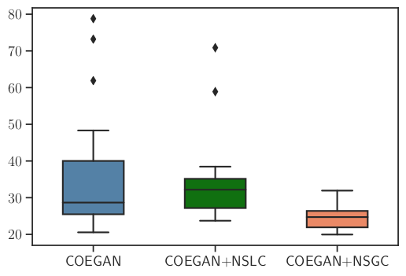

# Introduction

This repository contains the implementation of COEGAN and all code used in the evaluation and comparison with other methods, as presented in the paper Exploring the Evolution of GANs through Quality Diversity (https://gecco-2020.sigevo.org).

# Results

See below the results of the experiments presented in the paper.

## MNIST

### Best FID Score on the MNIST dataset:


### Boxplot of the FID score on MNIST dataset showing the performance of best generators computed for each independent run:



### Distribution of samples using t-SNE with the MNIST Dataset. 

We show samples from the input dataset, the best generator at the first generation, after ten generations, and at the end of training. We fed t-SNE with 1600 samples from each scenario and used the results for positioning them into a two-dimensional space. Samples are placed in a 120x120 grid, positioned according to t-SNE.

MNIST Dataset                                               |  Generation 1
:----------------------------------------------------------:|:-------------------------:
  |  

Generation 10                                               |  Generation 50
:----------------------------------------------------------:|:-------------------------:
  |  

## CelebA

### Best FID Score on the CelebA dataset:


# Environment Setup

Install pytorch:

```
conda install pytorch torchvision cudatoolkit=10.1 -c pytorch
```

Install dependencies:
```
pip install -r requirements.txt
```

## Run All Unit Tests

```
python -m unittest discover
```

# Experiments

## Configure the Training Setup

Edit the experimental settings in `default_config.py`.

## Start the Training:
```
python ./train.py
```

## Visualize the Results

Run JupyterLab

```
jupyter lab
```
